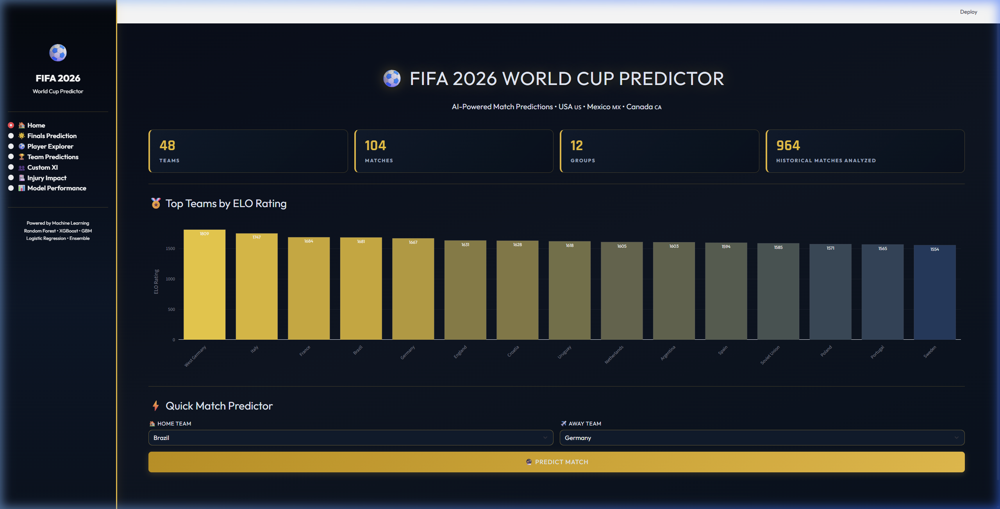
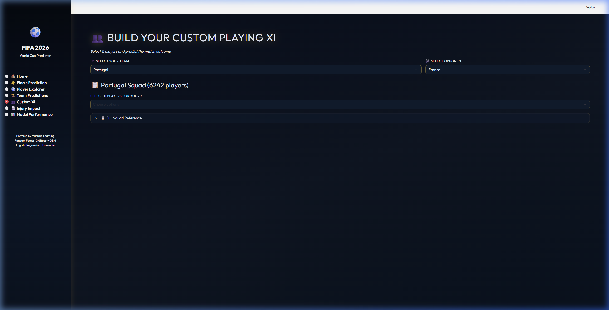
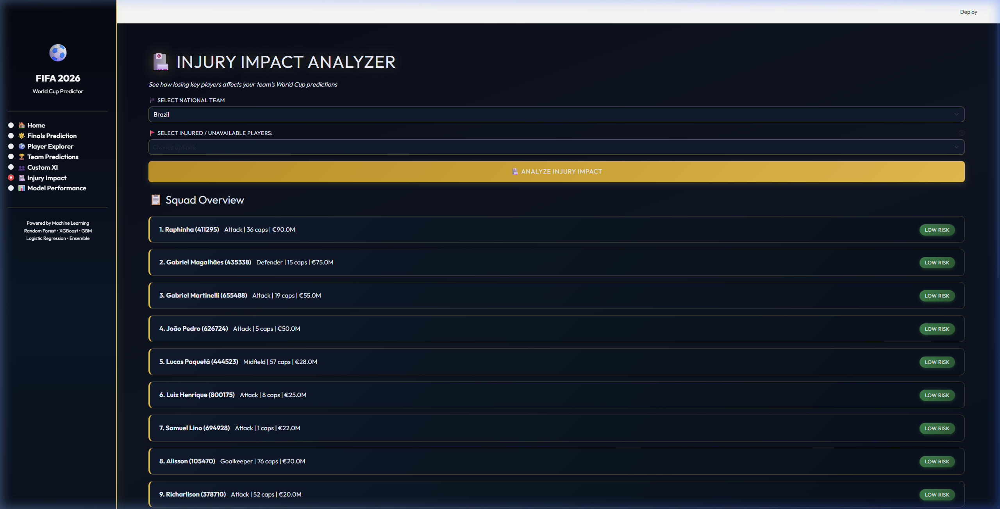

# ⚽ FIFA 2026 World Cup Predictor


An advanced Machine Learning ecosystem designed to simulate and forecast the outcomes of the **FIFA 2026 World Cup** (USA, Mexico, Canada). This dashboard leverages historical data from 1930–2022 to provide high-fidelity match predictions and interactive tournament visualizations.

## 📸 Feature Previews

### 🏠 Home Dashboard (ELO Analytics)


### 🏆 Interactive Finals Bracket


### 👥 Custom Playing XI Builder


### 🏥 Live Injury Impact Analyzer


---

## 🌟 Key Features

### 🏆 Finals Prediction "Roadway"
Simulate the entire tournament in one click! The engine ranks all 48 teams, simulates 104 group matches, and generates a **32-team interactive knockout bracket**. Trace the path from the Round of 32 all the way to the glory of the Final.

### 📋 Deep Match Analytics
Click on any match in the tournament bracket to see a simulated breakdown:
- **Match Stats:** Predicted Possession %, Shots, and Discipline (Yellow/Red Cards).
- **Goalscorers:** Dynamic assignment of goalscorers based on real-world squad statistics.

### 👥 Custom Playing XI Builder
Take control by selecting your own 11-man squad for any nation. The engine analyzes your XI's total market value, experience (caps), and positional balance to adjust the win probability.

### 🏥 Injury Impact Analyzer
Assess how a team's chances shift if they lose their star players. Input "injured" players to see a real-time recalculation of win/draw/loss probabilities.

---

## 🛠️ Technology Stack

- **Machine Learning:** Ensemble Voting Classifier (Random Forest + XGBoost + Gradient Boosting).
- **Frontend/UI:** Streamlit (Custom Dark/Gold FIFA UI Theme).
- **Mathematical Models:** Dynamic ELO Rating System & Expected Goals (xG) Approximation.
- **Data Source:** 900+ historical World Cup matches and 92,000+ player profiles.

---

## 🚀 Getting Started

### 1. Installation
Clone the repository and install the required Python libraries:
```bash
git clone https://github.com/yourusername/FIFA-2026-Predictor.git
cd FIFA-2026-Predictor
pip install -r requirements.txt
```

### 2. Data Preparation
For the best results, ensure your data folders (like `player_profiles/`, `player_injuries/`, etc.) are placed in the root directory. 
*Note: Large data files are excluded from this repository to keep the project lightweight.*

### 3. Training the AI
Before running the app, you need to train the machine learning models. Run the trainer script:
```bash
python model_trainer.py
```
This will generate the `.pkl` model files in the `models/` folder.

### 4. Running the Dashboard
Launch the interactive Streamlit application:
```bash
streamlit run app.py
```

---

## 📂 Project Structure

- `app.py`: Main Streamlit dashboard and UI logic.
- `prediction_engine.py`: Core simulation logic and bracket generation.
- `model_trainer.py`: Script to train and evaluate ML models.
- `data_processor.py`: Data cleaning and feature engineering.
- `requirements.txt`: List of dependencies.

---

## 📝 License

Distributed under the MIT License.

---

## 👨‍💻 Author

**Ranveer Singh Thakur**  
📩 [ranveersinghthakur33@gmail.com](mailto:ranveersinghthakur33@gmail.com)  
